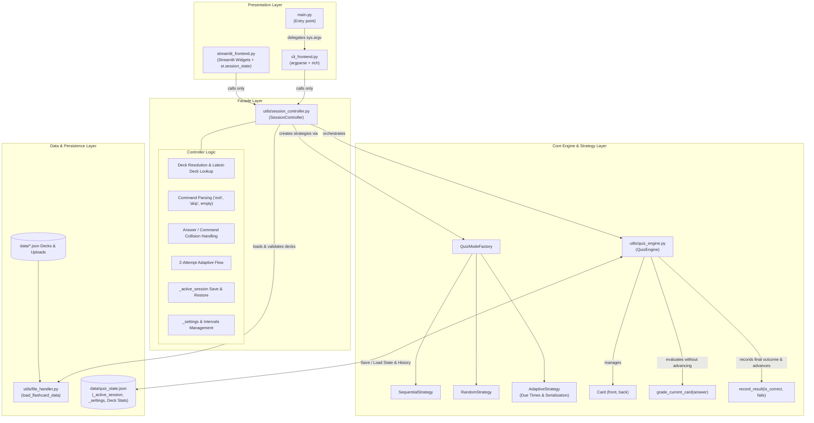

# plan.md

**Project:** Flashcard CLI Quizzer in Python

**Feature:** Dual User Interface (CLI & Streamlit) and Session Controller Facade

**Version:** 1.0

## Non-Negotiables:

All python code follows PEP 8 style guidelines
Proper error handling and input validation
Code is readable and maintainable
Functions have appropriate docstrings

## Technical Approach:

The UI layer introduces dual front-ends (`cli_frontend.py` and `streamlit_frontend.py`) supported by a shared, UI-agnostic Facade (`utils/session_controller.py`) that coordinates quiz rules, input handling, attempt progression, and session persistence without duplicating domain logic. Existing core components in `utils/quiz_engine.py` are extended to support two-phase grading, adaptive interval scheduling, state serialization, and safe error propagation.

1. **Phase 1: Quiz Engine Enhancements (`utils/quiz_engine.py`)**:
   - **Error Handling**: Define `StateFileError` carrying file path, line number, and column number when `json.load` encounters a `JSONDecodeError` in `_init_state`, refusing to corrupt or overwrite damaged state files.
   - **Two-Phase Card Progression**:
     - Introduce `grade_current_card(answer: str) -> bool` to perform evaluation without advancing or mutating state.
     - Introduce `record_result(is_correct: bool, fails: int)` to update card metrics, update `last_seen` timestamp, transition queues in the active strategy, trigger state save, and advance `_current_card`.
     - Preserve `answer_current_card(answer: str) -> bool` as a single-attempt backwards-compatible wrapper.
     - Update `_save_state` to propagate `OSError` failures rather than silently swallowing them.
   - **Adaptive Strategy Updates**:
     - Refactor `record_attempt(card: Card, fails: int)` to accept explicit failure count: 0 fails -> `15min`, 1 fail -> `10min`, 2 fails -> `5min`.
     - Implement due-time filtering in `get_next_card()`: return only cards that are new or whose interval has elapsed since `last_seen` (`current_time - last_seen >= interval`).
     - Add `seconds_until_next_due() -> float | None` to calculate remaining wait time when no cards are currently due.
     - Implement `to_dict()` and `from_dict()` for queue and timestamp serialization during active session resume.
   - **Statistics & Reserved Keys**:
     - Update deck and accuracy calculations to ignore reserved keys (`_active_session`, `_settings`).
     - Add an all-decks lifetime statistics helper (`get_all_decks_stats()`) computing total correct, total attempts, and overall accuracy across standard and `upload:` decks.

2. **Phase 2: Session Controller Facade (`utils/session_controller.py`)**:
   - Acts as a UI-agnostic Facade over `QuizEngine`, `QuizModeFactory`, and `file_handler.load_flashcard_data`.
   - **Deck Resolution & Latest-Deck Lookup**:
     - Scan `data/quiz_state.json` for non-upload decks to identify the deck holding the greatest card `last_seen` timestamp.
     - Resolve deck paths, validate file existence, regular file status, `.json` extension, and <= 1 MB file size constraint.
     - Validate deck contents: reject empty decks (`[]`), reject cards with front equal to reserved name `_settings`, and detect duplicate card fronts with warning logging.
     - Handle uploaded decks with sanitized basenames under `upload:<sanitized_basename>`.
   - **Command & Attempt State Machine**:
     - Parse inputs: trim whitespace and handle case-insensitive special commands (`exit`, `skip`). Re-prompt on empty inputs without consuming attempts.
     - Handle adaptive 2-attempt flow: attempt 1 incorrect prompts retry; attempt 2 resolves final outcome.
     - Manage command/answer collision: when card answer is literally `exit` or `skip`, grade first and defer state recording until intent is confirmed.
     - Process `skip` command as 1 incorrect attempt (counted as Difficult / fail count 2 in adaptive mode).
   - **Active Session Save & Resume (`_active_session`)**:
     - Persist `_active_session` dictionary into `data/quiz_state.json` after every recorded card outcome.
     - Support full session resumption for sequential (at `current_front`), random (`current_front` then shuffle), and adaptive (restoring queues, fails, and timestamps). Store in-memory card structures for `upload:` decks to enable full resume.
     - Discard `_active_session` safely when deck file or target card is missing, on graceful session end, or on progress reset.
   - **Configuration & Progress Reset**:
     - Manage custom queue intervals in `<deck>._settings.intervals` with defaults (300s, 600s, 900s).
     - Provide progress reset functionality that purges card history while preserving `_settings`.

3. **Phase 3: CLI Front-End (`cli_frontend.py` & `main.py`)**:
   - Thin presentation layer utilizing `argparse` and `rich` for terminal formatting.
   - CLI flags: `-f`/`--file` (optional, defaults to latest deck), `-m`/`--mode` (sequential, random, adaptive; case-insensitive), `--stats` (all-decks lifetime stats table and exit 0), `--state` (custom state path).
   - Custom `ArgumentParser.error` override to output single-line friendly red error and exit with code 1 instead of 2.
   - Rich markup escaping (`rich.markup.escape`) to prevent injection from card text.
   - Clean handling of `KeyboardInterrupt` (Ctrl+C) and `EOFError` (Ctrl+D) with graceful exit confirmation (`Quit? (y/n)`).
   - Session summary displayed on exit or adaptive completion ("All caught up! Next review in N min").
   - `main.py` reduced to simple delegation: `sys.exit(cli_frontend.main(sys.argv[1:]))`.

4. **Phase 4: Streamlit Front-End (`streamlit_frontend.py`)**:
   - Interactive local web dashboard built with Streamlit.
   - **Sidebar Controls**:
     - Deck selector dropdown populated from `data/*.json` (excluding state file), preselecting latest deck.
     - File uploader for custom decks (<= 1 MB, <= 1000 cards) stored under `upload:<name>`.
     - Mode selector (sequential, random, adaptive) with mid-session confirmation prompt.
     - Lifetime stats panel, weakest 5 cards table, and adaptive queue distribution breakdown.
     - Interval configuration dropdowns and deck progress reset with confirmation.
   - **Main Card Panel**:
     - Clean flashcard view, answer input form with Enter-key submission and Skip button.
     - Immediate feedback using `st.success` / `st.error` and Next card trigger.
     - Session resumption prompt on initial load when `_active_session` is detected.
   - State path configurable via `st.session_state["state_path"]` to allow seamless automated testing via `streamlit.testing.v1.AppTest`.

## Trade-offs:

- **Facade (`SessionController`) vs. Logic in Front-ends**:
  - *Decision*: Centralize all game rules, 2-attempt flow, command collisions, latest-deck resolution, and active-session management in `SessionController`.
  - *Trade-off*: Adds an extra architectural layer, but completely decouples presentation from business logic, prevents rule divergence between CLI and Streamlit, and allows comprehensive unit testing of game rules without mocking terminals or browser state.
- **Two-Phase Grading (`grade` + `record`) vs. Monolithic `answer_current_card`**:
  - *Decision*: Split evaluation into `grade_current_card(answer)` and `record_result(is_correct, fails)`.
  - *Trade-off*: Modifies internal engine interaction patterns, but cleanly supports multi-attempt flows (adaptive retry), skip commands, and answer/command collision confirmation prompts before committing state to disk.
- **Single Shared State File (`quiz_state.json`) vs. Multiple Deck Files**:
  - *Decision*: Maintain a single shared JSON file containing top-level `_active_session` and per-deck namespaces (`_settings`, card statistics).
  - *Trade-off*: Requires disciplined filtering of reserved keys across all analytics functions, but enables unified cross-deck lifetime accuracy (`--stats`), simplified backup, and cohesive latest-deck discovery without directory scanning.
- **Streamlit In-Memory Session State vs. Disk State**:
  - *Decision*: Maintain runtime instances (`SessionController`, `QuizEngine`, `QuizMode`) inside `st.session_state`, reading and writing persistent state (`quiz_state.json`) strictly at defined transaction points.
  - *Trade-off*: Requires guarding against unwanted object re-creation during Streamlit's reactive reruns, but ensures instantaneous UI updates and consistent card queue states across user clicks.
- **Single-Threaded Execution Model**:
  - *Decision*: Enforce single-user, single-active-process design without file locking mechanisms.
  - *Trade-off*: Concurrent execution of CLI and Streamlit simultaneously on the same state file is unsupported (last writer wins), but avoids platform-specific file locking complexities while satisfying project specifications.

## Files to Change:

- `project/main/requirements.txt`:
  - Add dependencies: `rich` and `streamlit`.
- `project/main/utils/quiz_engine.py`:
  - Add `StateFileError` exception class.
  - Add `grade_current_card(answer) -> bool` and `record_result(is_correct, fails)`.
  - Update `_init_state` to raise `StateFileError` on `JSONDecodeError`.
  - Update `_save_state` to propagate `OSError`.
  - Update `AdaptiveStrategy` to handle explicit fail counts, due timestamps, `seconds_until_next_due()`, and `to_dict()`/`from_dict()` serialization.
  - Add `get_all_decks_stats()` helper and filter out `_active_session` / `_settings` in stats calculations.
- `project/main/utils/session_controller.py` (New File):
  - Implement `SessionController` Facade covering deck resolution, latest deck lookup, input parsing, 2-attempt adaptive flow, collision handling, stats aggregation, interval settings, and `_active_session` persistence/restore.
- `project/main/cli_frontend.py` (New File):
  - Implement CLI interface using `argparse` and `rich`, including custom error exits, interactive loop, quit confirmation, and summary reporting.
- `project/main/streamlit_frontend.py` (New File):
  - Implement Streamlit UI including sidebar controls, card rendering, retry flow, queue inspection, custom intervals, file uploader, and resume prompts.
- `project/main/main.py`:
  - Update entry point to route execution directly to `cli_frontend.main(sys.argv[1:])`.
- `project/main/tests/test_quiz_engine.py`:
  - Add test for `StateFileError` raised on `json.JSONDecodeError` with exact file path, line, and column.
  - Add test for `grade_current_card(answer)` evaluating answers without advancing card or updating stats.
  - Add test for `record_result(is_correct, fails)` updating stats, recording `last_seen`, advancing `_current_card`, and persisting to disk.
  - Add test verifying `answer_current_card` remains functional as a one-attempt backwards-compatible wrapper.
  - Add test for `AdaptiveStrategy.record_attempt` with explicit failure counts (0 -> 15min, 1 -> 10min, 2 -> 5min).
  - Add test for `AdaptiveStrategy.get_next_card` filtering by due time (only new or elapsed interval).
  - Add test for `AdaptiveStrategy.seconds_until_next_due` returning expected seconds or None.
  - Add test for `AdaptiveStrategy.to_dict()` and `AdaptiveStrategy.from_dict()` queue and timestamp roundtrip.
  - Add test for stats helpers excluding reserved keys (`_active_session`, `_settings`).
  - Add test for all-decks lifetime accuracy computation across standard and upload decks.
  - Add test verifying `_save_state` raises or signals failure on `OSError`.
- `project/main/tests/test_session_controller.py` (New File):
  - Add unit tests for deck validation, latest deck resolution, collision management, adaptive retry logic, and active session save/restore.
- `project/main/tests/test_cli_frontend.py` (New File):
  - Add unit tests for CLI argument parsing, friendly error handling (exit 1), `--stats` output, Ctrl+C / Ctrl+D signals, and quit confirmation.
- `project/main/tests/test_integration.py` (New File):
  - Implement full end-to-end integration test `test_full_session` executing a scripted 3-card game with stats verification.
- `project/main/tests/test_streamlit_frontend.py` (New File):
  - Add automated AppTest tests covering deck selection, submission, adaptive retries, custom upload, and session resume.
- `project/main/README.md`:
  - Document CLI usage and flags, Streamlit launch command (`streamlit run streamlit_frontend.py`), and concurrency limitations.
- `project/main/docs/specs/UI/plan.md` (New File):
  - Architectural blueprint and implementation plan document.

## Sequencing:

1. **Step 1: Dependencies & Quiz Engine Enhancements (`utils/quiz_engine.py`)**:
   - Update `requirements.txt` with `rich` and `streamlit`.
   - Write failing unit tests in `tests/test_quiz_engine.py` for `StateFileError`, `grade_current_card`, `record_result`, adaptive due times, serialization, and all-deck stats.
   - Implement engine modifications in `utils/quiz_engine.py` following red -> green -> refactor cycle until all tests pass.
2. **Step 2: Session Controller Facade (`utils/session_controller.py`)**:
   - Write unit tests in `tests/test_session_controller.py` covering latest deck discovery, command parsing, collision handling, 2-attempt flow, interval settings, and `_active_session` save/restore.
   - Implement `SessionController` class in `utils/session_controller.py` satisfying all unit tests.
3. **Step 3: CLI Frontend & Integration Test (`cli_frontend.py`, `main.py`, `test_integration.py`)**:
   - Write unit tests in `tests/test_cli_frontend.py` covering argparse errors, `--stats`, signal handling, and summary output.
   - Implement `cli_frontend.py` with `rich` rendering.
   - Update `main.py` to forward CLI calls to `cli_frontend.main(sys.argv[1:])`.
   - Implement end-to-end test in `tests/test_integration.py::test_full_session`.
4. **Step 4: Streamlit Frontend Implementation (`streamlit_frontend.py`)**:
   - Write automated UI tests in `tests/test_streamlit_frontend.py` using `streamlit.testing.v1.AppTest`.
   - Implement `streamlit_frontend.py` with sidebar controls, card interaction forms, resume prompts, and error handling.
5. **Step 5: Documentation, Flake8 & Coverage Audit**:
   - Update `README.md` with CLI options, Streamlit launch instructions, and single-session notes.
   - Run `flake8` across the entire codebase and resolve any style or PEP 8 issues.
   - Run `pytest --cov=. --cov-report=html` and verify code coverage exceeds 80%.

## Additional Notes:

- All functions will strictly remain <= 40 lines of code with descriptive docstrings and PEP 8 formatting.
- Every function will conclude with edge case and security vulnerability comments.

## Mermaid Diagram

