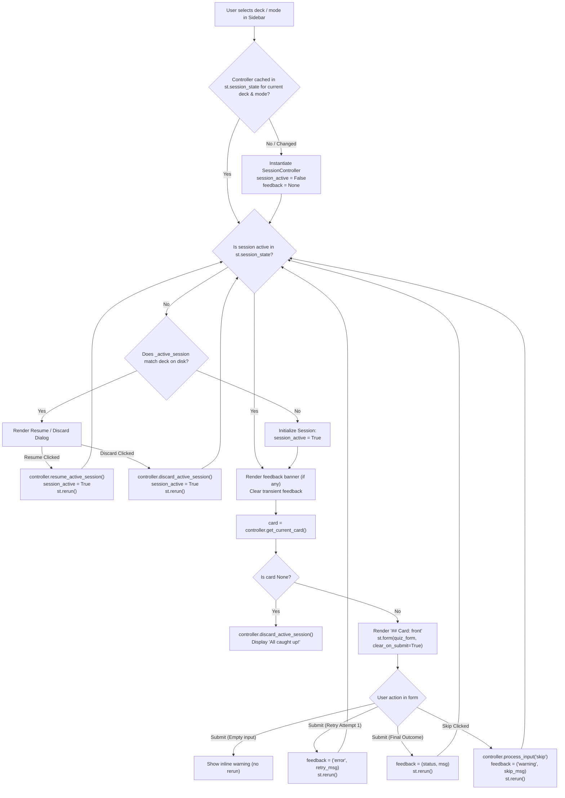

# plan.md

**Project:** Flashcard CLI Quizzer in Python  
**Feature:** Bug Fix: Streamlit Frontend Card Advance and Session Resumption  
**Version:** 1.1  

## Non-Negotiables:

- All python code follows PEP 8 style guidelines
- Proper error handling and input validation
- Code is readable and maintainable
- Functions have appropriate docstrings
- Keep all functions short and sweet, not longer than 40 lines
- Follow TDD practices: tests arrange, act, assert. Do red-green-refactor process
- For each function, in the comments at the end, list out every edge case and security vulnerability addressed (or `Edge Cases: None` and `Security Vulnerabilities: None`)

---

## Technical Approach

### 1. Root Cause Diagnosis

1. **Premature and Recurring Resume Prompt (`_render_resume_prompt`):**
   - In `streamlit_frontend.py`, `main()` instantiates a new `SessionController` on every Streamlit script execution pass without storing it in `st.session_state`.
   - When a user submits an answer or skips a card, `controller.process_input()` records the attempt and invokes `_save_active_session()`, persisting `_active_session` into `quiz_state.json`.
   - On subsequent interactions (or script reruns), `main()` creates another `SessionController`, which reads `_active_session` from `quiz_state.json`.
   - Because `_render_resume_prompt` checks disk-persisted `_active_session` unconditionally before rendering cards, it treats an in-progress session as a fresh load, displaying the "Found an active study session for this deck" prompt mid-quiz.

2. **"Resume Session" Button Trapped in Infinite Loop:**
   - When the user clicks **Resume Session**, `controller.resume_active_session()` restores card progress in memory, followed by `st.rerun()`.
   - Crucially, `resume_active_session()` does not delete `_active_session` from `quiz_state.json` (as it must survive browser refresh).
   - On the resulting rerun, `SessionController` is recreated, sees `_active_session` still in `quiz_state.json`, and triggers `_render_resume_prompt` again, making the button appear non-functional.

3. **Card Display Desynchronization on Submit / Skip:**
   - In `_render_card_panel`, `controller.get_current_card()` is retrieved and rendered into markdown (`## Card: {card.front}`) *before* the answer form is evaluated.
   - When the user clicks **Submit** or **Skip**, the answer or skip action processes and advances the engine to the next card, but the markdown was already emitted for the previous card.
   - Without an explicit rerun and coordinated state handling, the UI remains on the previous card until another interaction, which then falls into the resume prompt trap.

---

### 2. Architectural Design & Fix Strategy

1. **Session Lifecycle Tracking in `st.session_state`:**
   - Store the active `SessionController` instance and session metadata in `st.session_state`:
     - `st.session_state["controller"]`: Persists controller across script reruns for the current browser session.
     - `st.session_state["session_active"]`: Boolean indicating whether the study session is actively in progress in this tab.
     - `st.session_state["active_deck"]`: Tracks selected deck name to detect dropdown switches and reset state cleanly.
     - `st.session_state["active_mode"]`: Tracks selected study mode to reset state if mode changes.
     - `st.session_state["feedback"]`: Holds transient feedback tuple `(status, message)` to display above the card panel.
   - On deck or mode change: invalidate `st.session_state["controller"]`, set `st.session_state["session_active"] = False`, and clear `st.session_state["feedback"] = None`.
   - On progress reset confirmation: clear `st.session_state["controller"] = None` and `st.session_state["feedback"] = None` so a fresh controller with a reinitialized strategy starts from Card 1.

2. **Guarded Session Resumption (`_render_resume_prompt`):**
   - The prompt will only render on an uninitiated session (`st.session_state.get("session_active") is not True`) when `_active_session` exists on disk for the selected deck.
   - When **Resume Session** is clicked:
     - Execute `controller.resume_active_session()`.
     - Set `st.session_state["session_active"] = True`.
     - Clear any stale feedback.
     - Trigger `st.rerun()`. On rerun, the prompt is skipped, immediately revealing the resumed card and scoreboard.
   - When **Discard Session** is clicked:
     - Execute `controller.discard_active_session()`.
     - Set `st.session_state["session_active"] = True`.
     - Clear any stale feedback.
     - Trigger `st.rerun()`. On rerun, the prompt is skipped and the deck begins at card 1.

3. **Card Progression Flow (`_render_card_panel` & `_handle_submission`):**
   - Render stored feedback (if any) using `st.success`, `st.error`, or `st.warning` at the start of the card panel, then clear `st.session_state["feedback"]`.
   - If `card is None` (deck complete):
     - Call `controller.discard_active_session()` to clear completed session state from disk.
     - Display `st.success("🎉 All caught up!")`.
     - Return early.
   - Render the answer form using `st.form("quiz_form", clear_on_submit=True)` to natively reset text inputs across submissions without manual widget key mutations.
   - When **Submit** is clicked:
     - Process input via `controller.process_input(user_answer)`.
     - If `res.status == "empty"`: Display warning inline without advancing or triggering rerun.
     - If `res.status == "retry"` (adaptive mode, attempt 1): Store retry message in `st.session_state["feedback"] = ("error", res.message)` and call `st.rerun()`.
     - If `res.status == "correct"`: Store `("success", "✔ Correct!")` in `st.session_state["feedback"]` and call `st.rerun()`.
     - If `res.status == "incorrect"`: Store `("error", f"✘ Incorrect. Answer: {res.correct_answer}")` in `st.session_state["feedback"]` and call `st.rerun()`.
   - When **Skip** is clicked:
     - Process skip via `controller.process_input("skip")`.
     - Store `("warning", f"Skipped. Answer: {res.correct_answer}")` in `st.session_state["feedback"]` and call `st.rerun()`.
   - On rerun:
     - Feedback banner is displayed above the new card.
     - `controller.get_current_card()` fetches the newly advanced card (or `None` if deck complete).
     - The text input is automatically empty courtesy of `clear_on_submit=True`.

---

## Main Trade-offs Considered

1. **Persistent Controller in `st.session_state` vs. Disk-Only State Restoration:**
   - *Option A (Persistent Controller)*: Keep `controller` in `st.session_state` across reruns.
     - *Pros*: Preserves runtime iteration indices, attempt counts, and avoids re-reading/re-validating JSON decks from disk on every widget interaction.
     - *Cons*: Requires invalidation logic when the user selects a different deck, switches study modes, or resets progress.
     - *Decision*: Option A. A helper function `_get_or_create_controller(...)` invalidates controller and session flags when deck or mode changes; reset confirmation explicitly purges the cached controller.

2. **Explicit `st.rerun()` on Submit/Skip vs. In-Pass Conditional Rendering:**
   - *Option A (In-Pass Rendering)*: Attempt to evaluate form submissions before rendering the card title within a single execution pass using empty placeholders (`st.empty()`).
     - *Pros*: Avoids an extra script rerun cycle.
     - *Cons*: Complex layout sequencing, widget state desynchronization with `st.form`, and potential screen flickering.
   - *Option B (Feedback via `st.session_state` + `st.rerun()`)*: On submission or skip, save feedback, advance controller, and trigger `st.rerun()`.
     - *Pros*: Follows standard Streamlit reactive lifecycle; ensures clean top-down rendering; natively supported and verified by `AppTest`.
     - *Decision*: Option B.

3. **Form Input Clearing: `st.form(clear_on_submit=True)` vs. Manual Key Mutation:**
   - *Option A (Manual Mutation)*: Programmatically assign `st.session_state["user_answer"] = ""` before/after form submission.
     - *Pros*: Direct explicit control over value.
     - *Cons*: Risk of `StreamlitAPIException` when modifying an already instantiated widget key, requiring complex pre-instantiation checks or temporary staging keys.
   - *Option B (`st.form(clear_on_submit=True)`)*: Leverage native Streamlit declarative form parameter.
     - *Pros*: Guarantees clean input clearing on submit/skip without mutating widget session keys or triggering Streamlit exceptions.
     - *Decision*: Option B.

4. **Per-Deck Session Active Flag vs. Global Flag:**
   - *Option A (Global boolean `session_active`)*: Bypasses resume dialog on subsequent decks if user switches decks mid-session.
   - *Option B (Deck-keyed active state / reset on selection change)*: Resetting `session_active` whenever `selected_deck != st.session_state.get("active_deck")` guarantees that each deck's saved session is properly offered to the user.
   - *Decision*: Option B.

---

## Files to Change

1. `project/main/streamlit_frontend.py`:
   - Implement `_get_or_create_controller(deck_path, mode, state_path)` to cache the controller in `st.session_state`, reset state flags, and clear feedback on deck/mode changes.
   - Update `_render_sidebar`: upon confirming progress reset, clear `st.session_state["controller"]` and `st.session_state["feedback"]`.
   - Update `_render_resume_prompt(controller)` to check `st.session_state.get("session_active")` and set `st.session_state["session_active"] = True` on Resume/Discard.
   - Update `_render_card_panel(controller)`:
     - Render transient `st.session_state["feedback"]` banners and clear after rendering.
     - When `card is None`, invoke `controller.discard_active_session()`, display `"🎉 All caught up!"`, and return.
     - Configure `st.form("quiz_form", clear_on_submit=True)`.
     - Wire Submit and Skip to record feedback and invoke `st.rerun()`.
   - Update `_handle_submission(controller)` to store feedback messages into `st.session_state["feedback"]` and call `st.rerun()` on successful or final attempts.
   - Ensure all modified functions remain <= 40 lines, follow PEP 8, and include edge case / security vulnerability comments.

2. `project/main/tests/test_streamlit_frontend.py`:
   - Add automated UI tests verifying:
     - `test_streamlit_submit_advances_to_next_card`: Submitting a correct answer on Card 1 of a multi-card deck advances to Card 2, displays success feedback, and does not display the resume session dialog.
     - `test_streamlit_submit_incorrect_advances_to_next_card`: Submitting an incorrect answer on Card 1 advances to Card 2 with error feedback.
     - `test_streamlit_skip_advances_to_next_card`: Clicking Skip on Card 1 advances to Card 2 with warning feedback and without resume prompt.
     - `test_streamlit_resume_session_displays_resumed_card`: Clicking **Resume Session** dismisses the prompt and renders the active card instead of re-prompting.
     - `test_streamlit_completed_deck_clears_active_session`: Completing the final card clears `_active_session` on disk and renders `"All caught up!"`.
     - `test_streamlit_deck_reset_restarts_deck`: Confirming progress reset reinitializes the deck from Card 1 and clears saved active sessions.

---

## Sequencing for the Work (TDD Approach)

### Phase 1: Write Failing Tests (Red)
1. In `project/main/tests/test_streamlit_frontend.py`:
   - Write `test_streamlit_submit_advances_to_next_card` using a multi-card fixture (`Q1`, `Q2`). Submit `Ans1` and assert `at.markdown` contains `Q2` and `at.success` contains `Correct`, with no resume prompt displayed.
   - Write `test_streamlit_submit_incorrect_advances_to_next_card`. Submit wrong answer in sequential mode and assert `at.markdown` shows `Q2` and `at.error` contains `Incorrect`.
   - Write `test_streamlit_skip_advances_to_next_card`. Click `skip_button` and assert `at.markdown` shows `Q2` and `at.warning` contains `Skipped`.
   - Write `test_streamlit_resume_session_displays_resumed_card`. Pre-populate `_active_session` for `Q2`, click `resume_session_btn`, and assert the UI advances to display `Q2` and that `resume_session_btn` is no longer present.
   - Write `test_streamlit_completed_deck_clears_active_session`. Submit answer for a 1-card deck, assert `"All caught up!"` is displayed, and assert `_active_session` is absent from `quiz_state.json`.
   - Write `test_streamlit_deck_reset_restarts_deck`. Advance 1 card, trigger reset confirmation, assert card 1 is displayed on subsequent view.
2. Run `pytest project/main/tests/test_streamlit_frontend.py` to confirm test failures reproduce the reported bugs.

### Phase 2: Implementation (Green)
1. In `project/main/streamlit_frontend.py`:
   - Add controller caching and deck change detection (`_get_or_create_controller`).
   - Invalidate controller cache and feedback on reset progress confirmation in `_render_sidebar`.
   - Update `_render_resume_prompt` to respect `st.session_state["session_active"]` and set the flag upon user action.
   - Update `_render_card_panel` to clean up active session on completion, configure `clear_on_submit=True`, display feedback banners, and route Skip to feedback + `st.rerun()`.
   - Update `_handle_submission` to save feedback and call `st.rerun()`.
2. Run `pytest project/main/tests/test_streamlit_frontend.py` and ensure all tests pass.
3. Run the entire test suite (`pytest`) to ensure no regressions in existing CLI or Streamlit tests.

### Phase 3: Refactor & Verification
1. Verify function length compliance (<= 40 lines per function).
2. Verify PEP 8 compliance.
3. Verify comprehensive docstrings and Edge Cases / Security Vulnerabilities comments on all altered functions.
4. Run `pytest --cov=.` to verify test coverage.

---

## Mermaid Diagram

