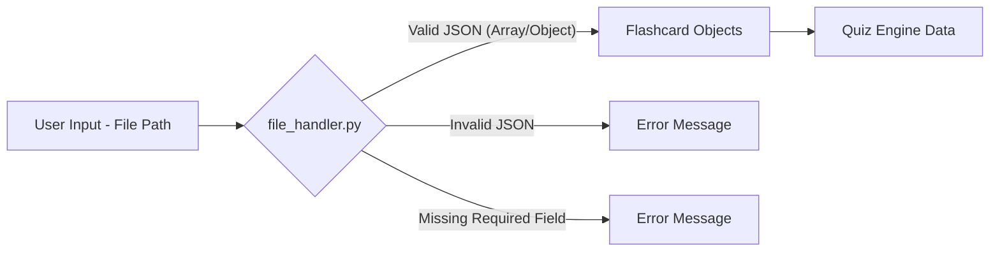

# spec.md

**Project:** Flashcard CLI Quizzer in Python

**Feature:** Flashcard Data Loading and Validation

**Version:** 1.0

## Non-Negotiables:

All code follows PEP 8 style guidelines
Proper error handling and input validation
Code is readable and maintainable
Functions have appropriate docstrings

## Intent/Goal:

This feature is responsible for loading flashcard data from JSON files into the application. It supports two distinct JSON formats: an array of card objects and a single object containing a ‘cards’ array. This is crucial because it provides the necessary data for the quiz engine to function, enabling users to learn and test their knowledge.

## Architecture:

- The application receives a file path as input.
- file_handler.py reads the JSON data from that file path.
- file_handler.py validates the JSON structure and content against our defined constraints (array/object format, required fields).
- If the JSON is valid, file_handler.py returns a list of flashcard objects (or a single object containing the cards). Regardless of whether the input file is an array or wrapped in an object, the loader normalizes and always returns a uniform list[dict[str, str]]
- The application then uses these flashcard objects to populate its data structures for use by the quiz engine.
- Each card must contain both "front" and "back" keys.
- Values for "front" and "back" must be non-empty strings.
- If "front" or "back" is missing, empty, or not a string, validation fails and an error is raised.

## Constraints:

- Only validate JSON files
- Only validate that the text has the correct structure and required fields
- Do not alter the JSON

## Acceptance Criteria:

- Given a valid JSON array of flashcard objects, the application successfully loads and returns the data without errors
- Given a valid JSON object containing a cards array, the application successfully loads and returns the data without errors
- Given a malformed JSON string, the application prints an error message to the console and does not crash
- Given a JSON object with a card missing the "back" field, the application prints an informative error message and does not crash

## Non-Goals:

- We won't validate whether flashcard text is grammatically correct or makes sense
- We will not convert any data
- We will not support files other than JSON

## Dependencies:

- Dependency on user input and json data file path

## Mockups/Diagrams:

## Notes:

[Any additional notes, considerations, or background information that might be helpful.]
