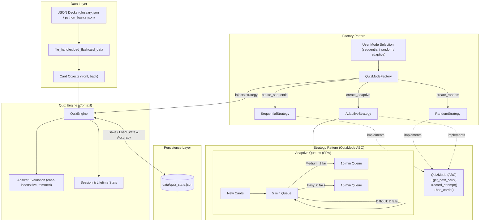

# plan.md

**Project:** Flashcard CLI Quizzer in Python

**Feature:** Quiz Engine (Strategy and Factory Patterns)

**Version:** 1.0

## Non-Negotiables:

All code follows PEP 8 style guidelines
Proper error handling and input validation
Code is readable and maintainable
Functions have appropriate docstrings

## Technical Approach:

The quiz engine implements the core quiz session logic using the **Strategy Pattern** for question-serving algorithms and the **Factory Pattern** for strategy instantiation. The implementation will reside in `project/main/utils/quiz_engine.py`, aligning with course verification requirements (`checked by inspecting quiz_engine.py`).

1. **Domain Model (`Card`)**:
   - Represents an individual flashcard with `front: str` and `back: str`.
   - Implements answer checking: case-insensitive comparison after trimming leading and trailing whitespace (`answer.strip().casefold() == self.back.strip().casefold()`).

2. **Strategy Hierarchy (`QuizMode` ABC)**:
   - Abstract base class defining the contract for question serving:
     - `get_next_card() -> Card | None`: Retrieves the next card to present.
     - `record_attempt(card: Card, is_correct: bool) -> None`: Updates strategy-internal state (queue placement, attempt count).
     - `has_cards() -> bool`: Indicates if reviewable cards remain.
   - **`SequentialStrategy`**:
     - Serves cards in original order (1, 2, 3...).
     - When the last card is reached, automatically cycles back to the first card, running indefinitely until the user quits.
   - **`RandomStrategy`**:
     - Selects cards randomly from the deck indefinitely until the user quits.
   - **`AdaptiveStrategy` (Spaced Repetition Algorithm - SRA)**:
     - Maintains tiered queues: `new`, `5min`, `10min`, `15min` (configurable with custom intervals: 30min, 1 hour, 24 hours, 1 week).
     - Prioritization order: `new` -> `5min` -> `10min` -> `15min`.
     - Automatic difficulty rating based on user failures per card (allows up to 2 attempts):
       - *Easy* (correct on first attempt): If in `5min` queue, advances to `15min` queue.
       - *Medium* (failed once, correct on second): Moves down one tier to `10min` queue.
       - *Difficult* (failed twice): Retained in the high-priority `5min` queue.
     - Inter-session decay: On session start, inspects elapsed time since last review timestamp and automatically re-categorizes cards into appropriate queues.

3. **Factory Pattern (`QuizModeFactory`)**:
   - Encapsulates strategy instantiation logic.
   - Exposes dedicated creation methods: `create_sequential(cards)`, `create_random(cards)`, `create_adaptive(cards, deck_name, state_data=None, custom_intervals=None)`. Also provides camelCase aliases (`createSequential`, `createRandom`, `createAdaptive`) for specification compatibility.
   - Exposes a dynamic selector method `create_mode(mode_name: str, cards: list[Card], ...)` that maps CLI mode strings (`"sequential"`, `"random"`, `"adaptive"`) to the corresponding strategy, validating mode input and raising `ValueError` on unknown modes.

4. **Context & Orchestration (`QuizEngine`)**:
   - Receives cards (loaded via `load_flashcard_data` from `file_handler.py`), deck name, and selected strategy.
   - Manages active quiz loop, session score tracking (correct/incorrect counts), and lifetime accuracy metrics.
   - Manages persistent quiz state saved to `data/quiz_state.json`:
     - Keyed by `deck_name` and `card.front`.
     - Tracks historical correct/incorrect counts and computes lifetime accuracy percentage (`(total_correct / total_attempts) * 100`).
     - Auto-initializes `data/quiz_state.json` cleanly if missing without raising errors or interrupting user flow.

## Trade-offs:

- **Single Module (`utils/quiz_engine.py`) vs. Subpackage (`utils/quiz/`)**:
  - *Decision*: Consolidate `Card`, `QuizMode`, concrete strategies, `QuizModeFactory`, and `QuizEngine` in `utils/quiz_engine.py`.
  - *Trade-off*: A single module keeps imports simple and directly satisfies rubric/instruction checks that inspect `quiz_engine.py`. To keep each class maintainable and adhere to the <=40 lines per function rule, helper functions and modular separation within the file will be maintained.
- **Clock Dependency Injection for SRA vs. Direct System Clock (`time.time`)**:
  - *Decision*: Inject an optional `time_provider` callable (defaulting to `time.time`) into `AdaptiveStrategy`.
  - *Trade-off*: Adds an optional parameter to constructor, but eliminates flaky sleep-based tests and guarantees deterministic unit testing of time decay and queue promotions.
- **State Persistence Location (Engine vs Strategy)**:
  - *Decision*: Centralize loading and writing of `data/quiz_state.json` in `QuizEngine` (utilizing existing `FileHandler`), passing snapshot state into `AdaptiveStrategy`.
  - *Trade-off*: Decouples storage concerns from card-ordering algorithms, ensuring strategies remain pure algorithmic components adhering to Single Responsibility Principle.
- **Infinite Looping Contract vs Stop Condition**:
  - *Decision*: In `SequentialStrategy` and `RandomStrategy`, the strategy provides an infinite sequence of questions as required by the specification. The session termination is controlled by caller interruption (quit signal) or `QuizEngine` session limit.

## Files to Change:

- `project/main/utils/quiz_engine.py` (New File):
  - Implementation of `Card`, `QuizMode` (ABC), `SequentialStrategy`, `RandomStrategy`, `AdaptiveStrategy`, `QuizModeFactory`, and `QuizEngine`.
- `project/main/tests/test_quiz_modes.py` (New File):
  - Unit tests for `QuizModeFactory` (`test_quiz_mode_factory`).
  - Unit tests for `AdaptiveStrategy` repetition and queue behavior (`test_adaptive_mode_behavior`).
  - Unit tests for `SequentialStrategy`, `RandomStrategy`, and answer evaluation.
- `project/main/tests/test_quiz_engine.py` (New File):
  - Unit tests for `QuizEngine` integration, score tracking, state persistence in `data/quiz_state.json`, and lifetime accuracy calculation.
- `project/main/docs/specs/quiz_engine/plan.md` (New File):
  - Architectural blueprint and implementation plan.

## Sequencing:

1. **Step 1: Domain Model (`Card`) and Answer Evaluation**:
   - Implement `Card` class with normalization and case-insensitive whitespace-trimmed answer comparison.
   - Write unit tests verifying exact, case-differing, and whitespace-padded answers.
2. **Step 2: Base Strategy (`QuizMode`) and Concrete Sequential / Random Strategies**:
   - Implement abstract `QuizMode` interface.
   - Implement `SequentialStrategy` (with wrap-around cycling) and `RandomStrategy`.
   - Write unit tests verifying sequence orders and cycle behavior.
3. **Step 3: Adaptive Strategy & Spaced Repetition Logic**:
   - Implement queue structures (`new`, `5min`, `10min`, `15min`) and custom interval configurations.
   - Implement failure tracking, attempt counts, and queue demotion/promotion rules.
   - Implement timestamp evaluation for inter-session card decay.
   - Write comprehensive unit tests for adaptive repetition and progression (`test_adaptive_mode_behavior`).
4. **Step 4: Factory Pattern (`QuizModeFactory`)**:
   - Implement `QuizModeFactory` with named creation methods and string dispatch selector.
   - Add input validation for invalid strategy modes.
   - Write unit tests for factory instantiation (`test_quiz_mode_factory`).
5. **Step 5: Engine Orchestration and State Persistence (`QuizEngine`)**:
   - Integrate `QuizEngine` with `file_handler.load_flashcard_data` to consume loaded cards.
   - Implement session loop coordinator, lifetime statistics computation, and `data/quiz_state.json` persistence.
   - Write unit tests verifying state persistence and accuracy calculations.
6. **Step 6: Flake8, PEP 8, and Coverage Verification**:
   - Run `flake8` and `pytest --cov` across the test suite to ensure PEP 8 compliance and >80% test coverage.

## Additional Notes:

- All functions will strictly remain <=40 lines of code with comprehensive docstrings and PEP 8 style formatting.
- Every function will include security vulnerability notes in trailing comments as required by project guidelines.

## Mermaid Diagram

